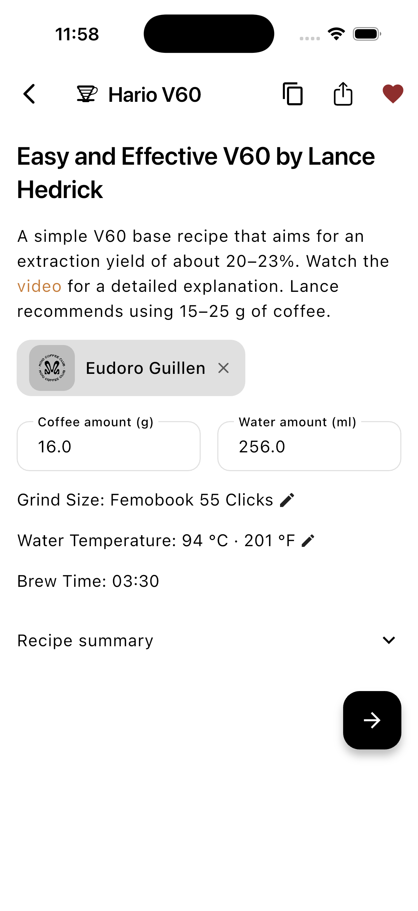
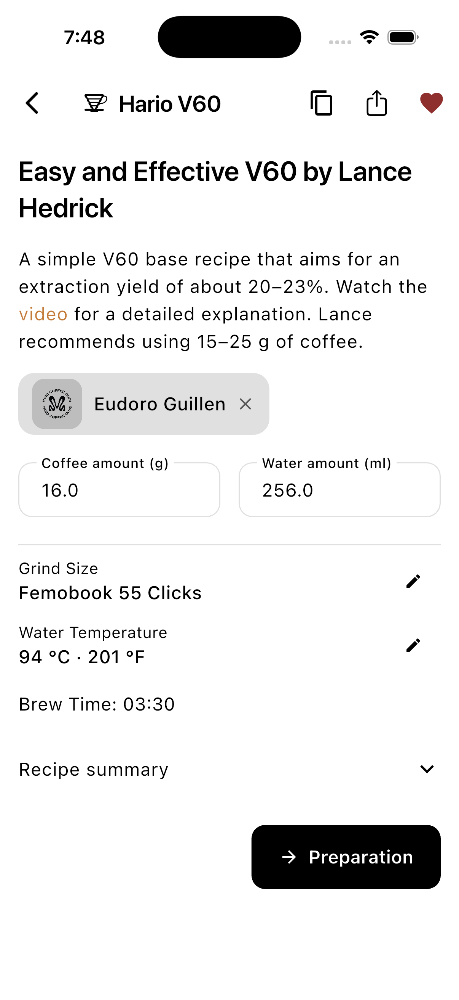

# Recipe setup polish — 2026-09-05

Branch: `codex/ui-polish`. Baseline: `e67548ed` (3.8.5+472).

Incremental changes: separate grind/temperature labels and values, aligned 48-point edit controls with accessible labels, a subtle divider, and a localized Preparation action using the existing button component.

| Before | After |
| --- | --- |
|  |  |

Both screenshots are actual iPhone 17 Pro simulator captures on iOS 26.5 with the same recipe and values. The baseline was rebuilt from the same starting commit.

Validation: full `flutter test test/` passed; `flutter analyze` retains the baseline 60 informational findings with no errors or warnings; iOS simulator debug build passed. Manually opened and confirmed both grind and temperature editors, followed Preparation, and returned to setup. A widget test covers German text at 2× scale on a 320-point screen and a single navigation callback.

Scope is recipe setup only. No merge or publication performed.
